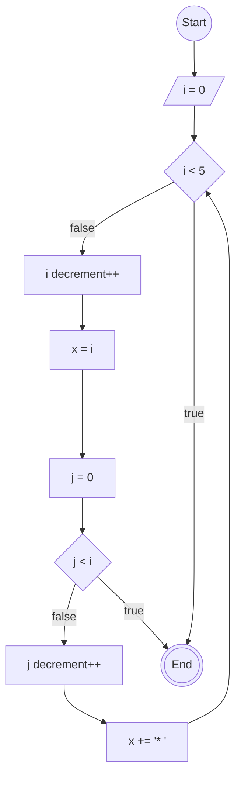

```mermaid
flowchart TD

mulai@{ shape: circle, label: "Start"}
i@{ shape: lean-r, label: "i = 0"}
loop@{ shape: diamond, label: "i < 5"}
i+@{ shape: rect, label: "i decrement++"}
x@{ shape: rect, label: "x = i"}

j@{ shape: rect, label: "j = 0"}
loop2@{ shape: diamond, label: "j < i"}
x2@{ shape: rect, label: "x += '* '"}
j+@{shape: rect, label: "j decrement++"}
selesai@{ shape: doublecircle, label: "End"}

mulai-->i-->loop--false-->i+-->x
x-->j-->loop2--false-->j+-->x2
x2-->loop
loop--true-->selesai
loop2--true-->selesai


```
