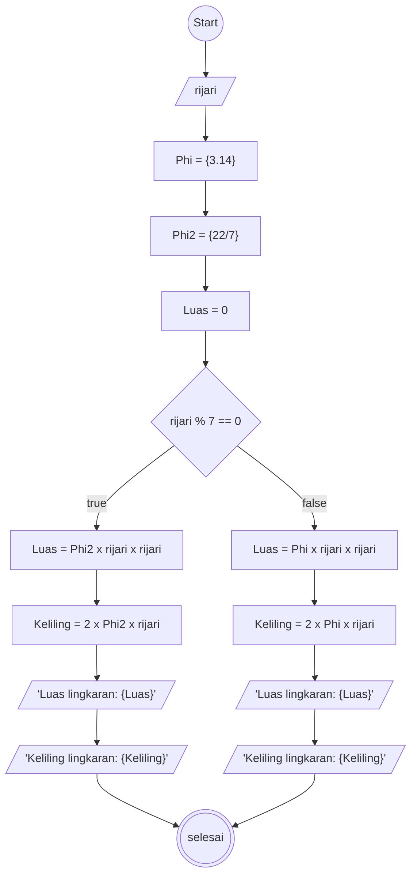

# JavaScript1

## Case: menghitung Keliling dan luas lingkaran

```mermaid

flowchart TD

mulai@{ shape: circle, label: "Start"}
r@{ shape: lean-r, label: "rijari"}
TT@{ shape: rect, label: "Phi = {3.14}"}
T2@{ shape: rect, label: "Phi2 = {22/7}"}
H1@{ shape: rect, label: "Luas = 0"}
K1@{ shape: rect, label: "Keliling = 0"}
Modulus@{ shape: diamond, label: "rijari % 7 == 0"}
L@{ shape: rect, label: "Luas = Phi2 x rijari x rijari"}
K@{ shape: rect, label: "Keliling = 2 x Phi2 x rijari"}
L1@{ shape: rect, label: "Luas = Phi x rijari x rijari"}
K1@{ shape: rect, label: "Keliling = 2 x Phi x rijari"}
HL@{ shape: lean-r, label: "'Luas lingkaran: {Luas}'"}
HK@{ shape: lean-r, label: "'Keliling lingkaran: {Keliling}'"}
HL2@{ shape: lean-r, label: "'Luas lingkaran: {Luas}'"}
HK2@{ shape: lean-r, label: "'Keliling lingkaran: {Keliling}'"}
selesai@{ shape: doublecircle, label "end"}


mulai-->
r-->
TT-->
T2-->
H1-->
Modulus--true-->L--> K--> HL-->HK-->selesai
Modulus--false--> L1-->K1-->HL2-->HK2-->selesai

```
